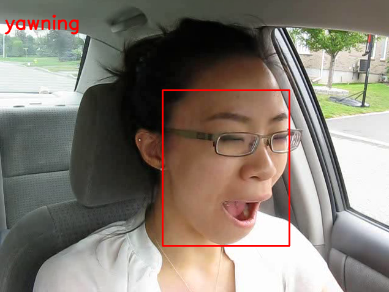

# **Drowsy-Alert** 

A lightweight drowsiness detection system using Mediapipe's **Face Landmark Detection Model** and a **RandomForestClassifier** to classify states like `normal` or `yawning` based on facial blendshapes. It supports real-time webcam inference and video processing.



## **Quick Setup**

Create an enviroment:
   ```bash
   git clone https://github.com/hannalaguilar/drowsy-alert
   cd drowsy-alert
   conda create --name drowsy-alert python=3.10
   conda activate drowsy-alert
   pip install -r requirements.txt
   ````

### 1. Real-Time APP

```bash
streamlit run app.py
```


